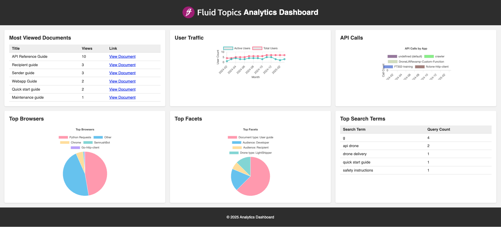
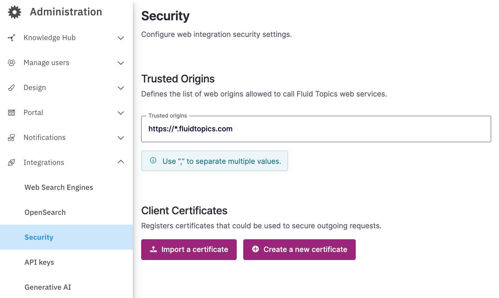

# Integrating the Fluid Topics Analytics API

The files  in the `dashboard` directory provide a landing page showcasing the Fluid Topics Analytics API through various integration examples.

The page displays as illustrated below:

<span style="display:block;text-align:center">
    
</span>

To serve this page, the following steps are required:

- Modify the `script.js` file as follows:

  - Update the `FLUID_TOPICS_PORTAL` variable with the URL of the targeted Fluid Topics portal.
  - Update the `API_KEY` variable with a valid API Key having the `ANALYTICS_USER` role.

- Run a web server from the current directory *e.g*., a Python web server:

```shell
  cd analytics-api/dashboard/
  python3 -m http.server 8000
```

Once the web server is running, the dashboard can be accessed at: http://localhost:8000.

**Note**: Ensure that the domains from which you are calling the API are included under `Integrations > Security > Trusted Origins` in the targeted Fluid Topics portal.

<span style="display:block;text-align:center">
    
</span>
